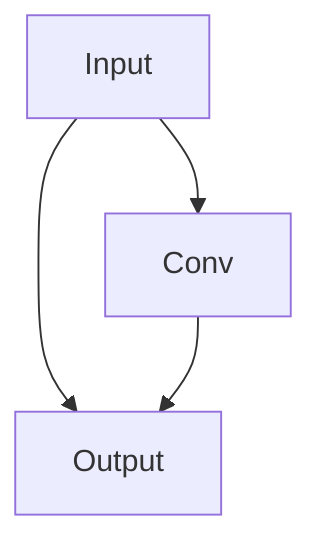

## conv 卷积块  
该块可以包含以下任意内容组成序列，所有层采用该块统一配置  

mode|功能  
---|---  
C|卷积层
T|反卷积
B|批归一化
R|LeakyRelu
h|Tanh

## ResBlock 残差块
Here is a simple flow chart:

  

## 卷积层参数预设
kernal|stride|padding|outsize  
---|---|---|--- 
3|1|1|size
4|2|1|size
3|2|1|size/2
1|1|0|size

## 反卷积参数预设
kernal|stride|padding|outsize  
---|---|---|---  
4|2|1|size*2  
